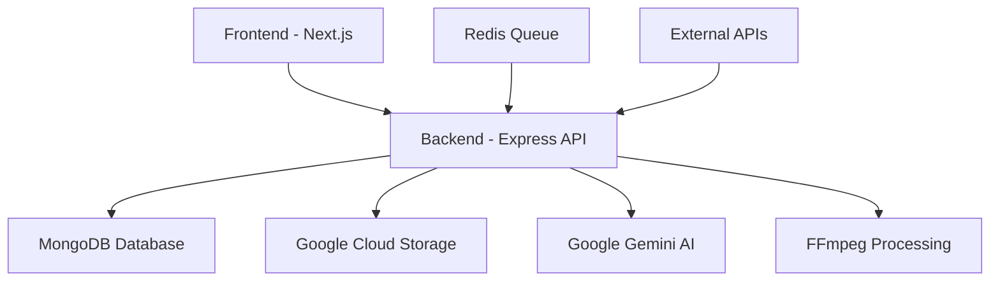

# 🎬 Vinci Clips - Open Source AI Video Clipping Platform

<div align="center">


**Transform long videos into engaging short clips with AI-powered precision**

[](https://www.gnu.org/licenses/agpl-3.0)
[](https://nodejs.org/)
[](https://nextjs.org/)
[](https://mongodb.com/)

[**🚀 Try Hosted Version**](https://tryvinci.com) • [**📖 Documentation**](#installation) • [**🐛 Report Bug**](https://github.com/tryvinci/vinci-clips/issues) • [**💡 Request Feature**](https://github.com/tryvinci/vinci-clips/issues)

</div>

---

## ✨ What is Vinci Clips?

Vinci Clips is an **open-source AI-powered video clipping platform** that automatically generates short, engaging video clips from longer videos. Perfect for content creators, marketers, and social media managers who want to maximize their video content's reach across platforms.

### 🎯 **Want to skip the setup?** 
👉 **[Get started instantly with our hosted solution at tryvinci.com](https://tryvinci.com)** - No installation required!

---

## 🚀 Key Features

### 🎥 **Smart Video Processing**
- **AI-Powered Clip Generation**: Automatically identifies the best moments for short-form content
- **Multi-Platform Import**: Upload files or import from YouTube, Vimeo, Instagram, LinkedIn, TikTok
- **Intelligent Transcription**: Speaker diarization and precise timestamp alignment
- **Thumbnail Generation**: Automatic video thumbnail creation

### 🎨 **Social Media Optimization** 
- **Auto-Reframing**: Automatically adjust videos for different aspect ratios (9:16, 1:1, 16:9)
- **AI-Generated Captions**: Synchronized, customizable captions with multiple styles
- **B-roll Integration**: Context-aware supplementary content generation
- **Platform-Specific Formats**: Optimized output for TikTok, Instagram, YouTube Shorts

### 🔧 **Developer-Friendly**
- **Modern Tech Stack**: Next.js, Node.js, MongoDB, Google Cloud
- **Comprehensive APIs**: RESTful endpoints for all functionality
- **Real-time Status Tracking**: WebSocket support for live updates
- **Extensive Logging**: Production-ready logging and monitoring

### 🏢 **Enterprise Ready**
- **Background Job Processing**: Scalable video processing with Redis queues
- **Cloud Storage Integration**: Google Cloud Storage with CDN support
- **Comprehensive Error Handling**: Automatic retries and graceful degradation
- **Security First**: Best practices for API keys and data protection

---

## 🏗️ Architecture Overview



**Technology Stack:**
- **Frontend:** Next.js 15+ with React, TypeScript, Tailwind CSS, Shadcn/ui
- **Backend:** Node.js with Express, comprehensive logging, modular architecture
- **Database:** MongoDB with Mongoose ODM for data persistence
- **AI Services:** Google Gemini API for transcription and content analysis
- **Cloud Storage:** Google Cloud Storage for scalable file management
- **Video Processing:** FFmpeg for conversion, thumbnail generation, and manipulation
- **Job Queue:** Redis with Bull for background processing (planned)
- **Deployment:** Docker-ready with environment-based configuration

## Core Workflow

### Current Implementation
1.  **Input:** Users upload video files (up to 2GB) through drag-and-drop interface with real-time progress tracking.
2.  **Processing:** Backend converts videos to MP3 and generates thumbnails using FFmpeg with status updates.
3.  **Cloud Storage:** Videos, audio files, and thumbnails uploaded to Google Cloud Storage in parallel for efficiency.
4.  **Transcription:** Gemini API transcribes audio with speaker diarization and precise timestamp alignment.
5.  **Analysis:** AI analyzes transcripts to suggest 3-5 optimal clips with single or multi-segment options.
6.  **Generation:** Users can generate actual video clips from AI suggestions with cloud storage integration.
7.  **Database:** Comprehensive data storage with status tracking (uploading → converting → transcribing → completed).
8.  **Display:** Homepage with recent videos, status indicators, and detailed transcript view with inline video playback.

### Enhanced Features (Roadmap)
9.  **URL Import:** Import videos from YouTube, Instagram, LinkedIn, Vimeo using just URLs.
10. **Auto-Reframing:** Automatically adjust clips for social media aspect ratios (9:16, 1:1, 16:9).
11. **AI B-roll:** Generate contextually relevant B-roll content to enhance clip engagement.
12. **Captioning:** Add synchronized, stylized captions with customization options.
13. **Social Publishing:** Schedule and post clips directly to social media platforms with AI-generated metadata.

## Getting Started

### Prerequisites

-   Node.js (v18 or later)
-   `ffmpeg` installed and available in your system's PATH.
-   A Google Cloud Platform account with a service account key and a GCS bucket.
-   A MongoDB database and connection string.
-   A Gemini API key.

### Installation

1.  **Clone the repository:**
    ```bash
    git clone <repository-url>
    cd vinci-clips
    ```

2.  **Install dependencies for both frontend and backend:**
    ```bash
    npm install
    ```

3.  **Set up environment variables:**
    Create a `.env` file in the `backend` directory and add the following:
    ```
    PORT=8080
    DB_URL=<your-mongodb-connection-string>
    GCP_BUCKET_NAME=<your-gcs-bucket-name>
    GCP_SERVICE_ACCOUNT_PATH=<path-to-your-gcp-service-account.json>
    GEMINI_API_KEY=<your-gemini-api-key>
    ```

4.  **Run the application:**
    ```bash
    npm start
    ```
    This will start both the backend and frontend servers. The frontend will be available at `http://localhost:3000`.

---

## Development Roadmap & Status

This section outlines the current implementation status and future development priorities for Vinci Clips.

### ✅ Core Features (Completed)

| Feature Category        | Implementation                                                                                               | Status      |
| ----------------------- | ------------------------------------------------------------------------------------------------------------ | ----------- |
| **Video Upload System** | Drag-and-drop interface with 2GB file size limit and real-time progress tracking                           | **Complete** |
| **Status Management**   | Comprehensive status tracking: uploading → converting → transcribing → completed/failed                    | **Complete** |
| **Video Processing**    | FFmpeg-based video-to-MP3 conversion with thumbnail generation                                              | **Complete** |
| **Cloud Integration**   | Parallel upload to Google Cloud Storage with signed URL generation                                          | **Complete** |
| **AI Transcription**    | Gemini API transcription with speaker diarization and precise timestamps                                    | **Complete** |
| **Clip Analysis**       | AI-powered analysis suggesting 3-5 clips with single/multi-segment support                                 | **Complete** |
| **Clip Generation**     | FFmpeg-based video clip generation with cloud storage integration                                           | **Complete** |
| **Frontend Interface**  | Homepage with recent videos, status indicators, and detailed transcript view with video playback           | **Complete** |
| **Database Layer**      | MongoDB with Mongoose ODM, comprehensive data modeling                                                      | **Complete** |

### 🚧 Priority Development Areas

#### **Phase 1: Core Platform Enhancements** (High Priority)
| Feature                    | Description                                                                                               | Effort      |
| -------------------------- | --------------------------------------------------------------------------------------------------------- | ----------- |
| **URL Video Import**       | Import videos from YouTube, Instagram, LinkedIn, Vimeo, TikTok using URLs                               | **High**    |
| **Clip Generation Fixes**  | Fix routing issues, improve error handling, add progress tracking                                        | **Medium**  |
| **Enhanced UI/UX**         | Responsive design, better loading states, mobile optimization                                            | **Medium**  |
| **Performance Optimization** | Background job processing, caching, database indexing                                                  | **High**    |

#### **Phase 2: Advanced Content Features** (Medium Priority)
| Feature                    | Description                                                                                               | Effort      |
| -------------------------- | --------------------------------------------------------------------------------------------------------- | ----------- |
| **Auto-Reframing**         | AI-powered aspect ratio adjustment (9:16, 1:1, 16:9) with MediaPipe subject detection                  | **High**    |
| **Captioning System**      | Synchronized captions with style customization, SRT export, multi-language support                     | **Medium**  |
| **AI B-roll Generation**   | Context-aware B-roll creation and seamless integration                                                  | **High**    |
| **Clip Preview & Editing** | Timeline-based clip editing with trim controls and preview functionality                                | **Medium**  |

#### **Phase 3: Social Media & Publishing** (Lower Priority)
| Feature                    | Description                                                                                               | Effort      |
| -------------------------- | --------------------------------------------------------------------------------------------------------- | ----------- |
| **Social Media Integration** | Direct publishing to YouTube, TikTok, Instagram, Facebook, LinkedIn, X                                | **High**    |
| **Content Scheduling**     | Calendar-based scheduling with optimal posting time suggestions                                          | **Medium**  |
| **AI Metadata Generation** | Automatic captions, hashtags, and descriptions for social posts                                         | **Medium**  |
| **Analytics Dashboard**    | Performance tracking, engagement metrics, usage analytics                                               | **Medium**  |

### 🔧 Technical Debt & Infrastructure

| Area                       | Priority | Description                                                                                               |
| -------------------------- | -------- | --------------------------------------------------------------------------------------------------------- |
| **Error Handling**         | High     | Comprehensive error handling, user-friendly messages, retry mechanisms                                   |
| **Testing Suite**          | High     | Unit tests, integration tests, E2E testing with Playwright                                              |
| **Documentation**          | Medium   | API documentation, deployment guides, developer onboarding                                              |
| **Security**               | High     | Authentication system, API rate limiting, data encryption                                                |
| **Monitoring**             | Medium   | Application monitoring, performance metrics, error tracking                                              |

### 📊 Current Implementation Status

- **Backend API:** 8/10 core endpoints implemented
- **Frontend UI:** 6/8 major components complete  
- **Database Schema:** Fully implemented with status tracking
- **Video Processing:** Core pipeline complete, needs optimization
- **AI Integration:** Transcription and analysis functional
- **Cloud Storage:** Complete implementation with signed URLs

---

## Next Steps Priority Order

1. **Fix clip generation routing issues** and improve error handling
2. **Implement URL video import** for major platforms  
3. **Add comprehensive testing suite** and monitoring
4. **Develop auto-reframing system** for social media optimization
5. **Build captioning and B-roll features** for content enhancement
6. **Create social media publishing pipeline** for end-to-end workflow

This roadmap will be updated as development progresses and priorities evolve based on user feedback and market demands. 